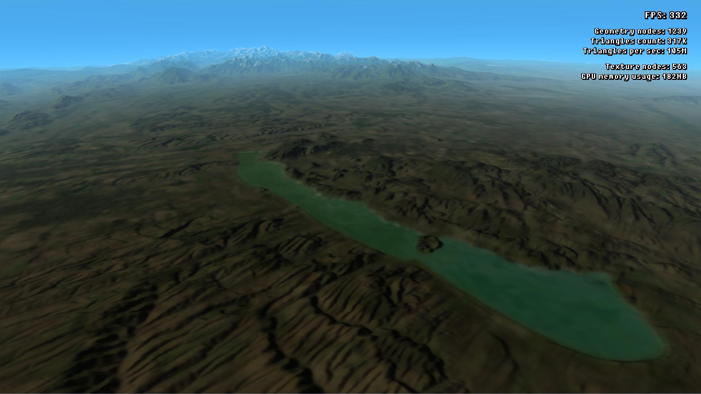
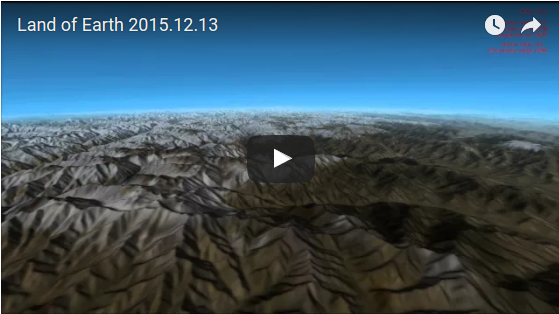

Land of Earth Reloaded
======================

This is a rewritten version of my original [Land of Earth](https://github.com/Tomius/LoE) project, with a different dataset representation and streaming method, resulting in better performance and visual quality.

Land of Earth is a global spherical terrain renderer that uses a 172800 * 86400 heightmap, is based on my engine [Silice3D](https://github.com/Tomius/Silice3D) and it works realtime. It is an "extension" of [Filip Strugar's CDLOD concept](http://www.vertexasylum.com/downloads/cdlod/cdlod_latest.pdf), with texture streaming of course. Unfortunately I couldn't upload the dataset required to run this code.

Camera usage (press space to switch between them):
----------------------------------------------------
* FPS camera
  * WASD keys: position
  * mouse move: camera direction
  * mouse scroll: movement speed
* Sphere viewer camera (default):
  * mouse move: position
  * mouse scroll: zoom

----------------------
If you have any problem, please post in the issues tab or mail me at icyplusplus@gmail.com. Any feedback would be appreciated.

